# framework4j 分布式 ID SDK 使用指南 (v1.0.0)

> **高性能 | 分布式 | 开箱即用** - 基于 Snowflake 算法的企业级 ID 生成解决方案

**当前版本**: v1.0.0-SNAPSHOT

---

## 📚 目录

- [1. 系统概览](#1-系统概览)
- [2. 环境要求](#2-环境要求)
- [3. 快速接入](#3-快速接入)
- [4. 核心功能](#4-核心功能)
- [5. 高级特性](#5-高级特性)
- [6. 最佳实践](#6-最佳实践)
- [7. 故障排查](#7-故障排查)

---

## 1. 系统概览

### 1.1 架构设计

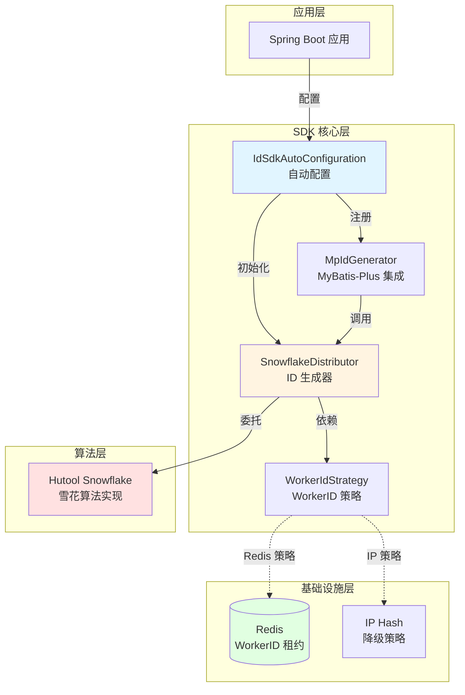

### 1.2 ID 结构

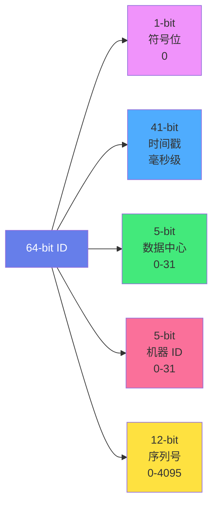

**特点：**
- 📅 **时间有序**：ID 按生成时间递增
- 🌍 **全局唯一**：支持 1024 个节点 (32×32)
- ⚡ **高性能**：单节点 400万+ QPS
- 🔒 **无冲突**：同毫秒内支持 4096 个 ID

---

## 2. 环境要求

### 2.1 基础环境

| 组件 | 版本要求 | 说明 |
|------|---------|------|
| **JDK** | 17+ | Spring Boot 3 最低要求 |
| **Spring Boot** | 3.0+ | 必须使用 Jakarta 命名空间 |
| **Hutool** | 5.8.26+ | 雪花算法核心实现 |
| **Redis** | 6.0+ | 推荐用于 WorkerID 分配（可选） |
| **MyBatis-Plus** | 3.5.3.1+ | 自动 ID 生成集成（可选） |

### 2.2 部署拓扑

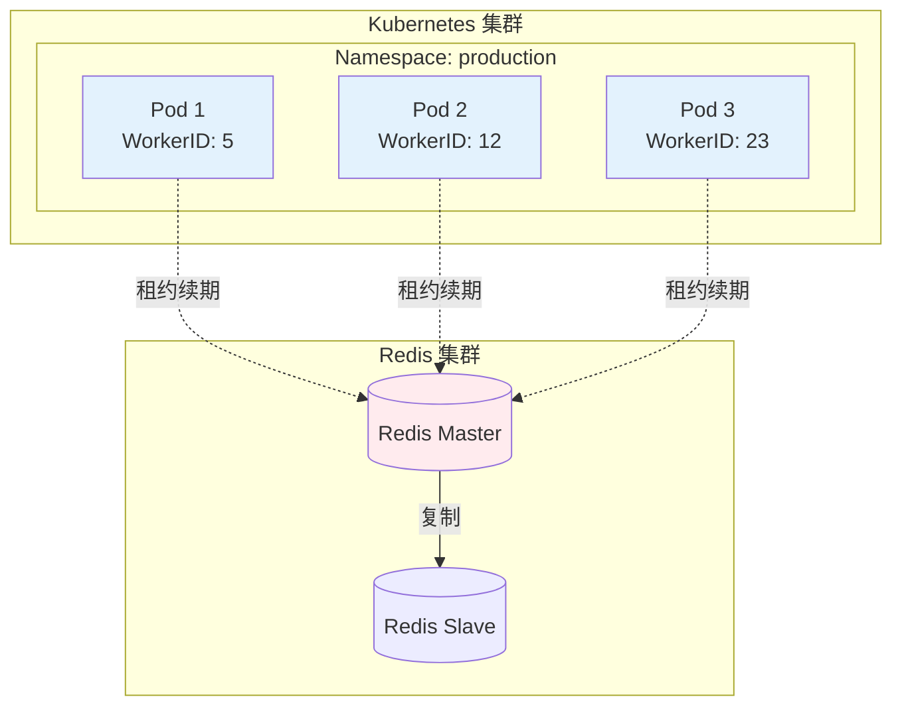

---

## 3. 快速接入

### 3.1 引入依赖

```xml
<dependencies>
    <!-- ✅ ID SDK Starter（必须） -->
    <dependency>
        <groupId>fun.commons</groupId>
        <artifactId>framework4j-all</artifactId>
        <version>1.0.0-SNAPSHOT</version>
    </dependency>

    <!-- ✅ Hutool 核心包（必须） -->
    <dependency>
        <groupId>cn.hutool</groupId>
        <artifactId>hutool-core</artifactId>
        <version>5.8.26</version>
    </dependency>

    <!-- ⭕ Redis（推荐，生产环境必备） -->
    <dependency>
        <groupId>org.springframework.boot</groupId>
        <artifactId>spring-boot-starter-data-redis</artifactId>
    </dependency>

    <!-- ⭕ MyBatis-Plus（可选，需要自动 ID 时） -->
    <dependency>
        <groupId>com.baomidou</groupId>
        <artifactId>mybatis-plus-boot-starter</artifactId>
        <version>3.5.14</version>
    </dependency>
</dependencies>
```

### 3.2 配置文件

```yaml
spring:
  application:
    name: order-service  # 必须配置，用于 Redis Key 前缀

# ID SDK 配置
framework4j:
  id:
    worker:
      strategy: redis          # 策略: redis（推荐）/ ip（降级）
      redis-name: stringRedisTemplate  # Redis Bean 名称
    mybatis:
      enabled: true            # 是否集成 MyBatis-Plus
```

### 3.3 配置流程

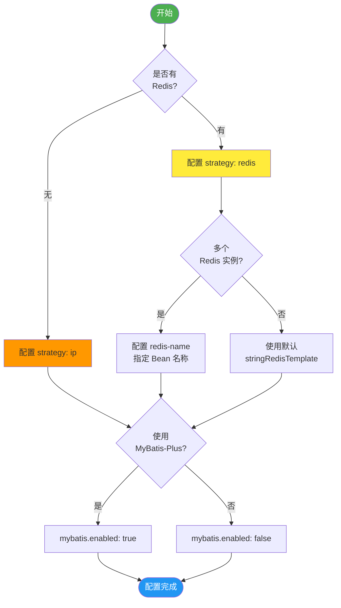

### 3.4 验证启动

启动应用后，观察日志输出：

```log
✅ [ID-SDK] WorkerID strategy: Redis
✅ [ID-SDK] WorkerID acquired via Redis Lease: 5
✅ [ID-SDK] Snowflake initialized. SDK_WorkerId: 5 -> (workerId:5, datacenterId:0), Epoch: 1704067200000
✅ [ID-SDK] MyBatis-Plus IdentifierGenerator registered
```

---

## 4. 核心功能

### 4.1 自动 ID 生成（MyBatis-Plus）

```java
@Data
@TableName("t_order")
public class Order {
    // 主键自动生成 ID
    @TableId(type = IdType.ASSIGN_ID)
    private Long id;

    private String orderNo;
    private BigDecimal amount;
}

// 使用
@Service
public class OrderService {
    @Autowired
    private OrderMapper orderMapper;

    public void createOrder() {
        Order order = new Order();
        order.setOrderNo("ORD20250128001");
        order.setAmount(new BigDecimal("99.99"));

        // 插入时自动生成 ID
        orderMapper.insert(order);

        System.out.println("Generated ID: " + order.getId());
        // 输出: Generated ID: 252630510801928192
    }
}
```

### 4.2 手动生成 ID

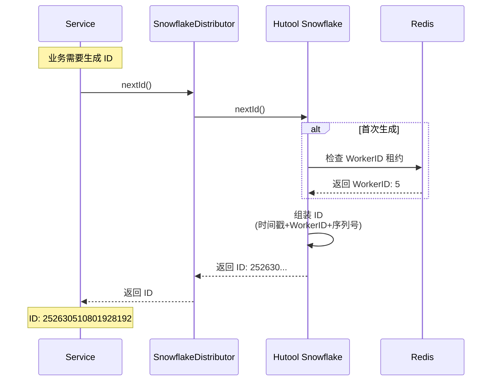

**代码示例：**

```java
@Service
public class IdService {
    @Autowired
    private SnowflakeDistributor snowflake;

    // 单个 ID 生成
    public Long generateId() {
        return snowflake.nextId();
    }

    // 批量 ID 生成
    public List<Long> generateBatch(int count) {
        return snowflake.nextIds(count);
    }

    // 业务示例：发送 MQ 消息
    public void sendMessage(String content) {
        Long messageId = snowflake.nextId();

        Message msg = Message.builder()
            .id(messageId)
            .content(content)
            .timestamp(System.currentTimeMillis())
            .build();

        mqProducer.send(msg);
    }
}
```

### 4.3 OpenID 混淆

**用途：** 防止前端泄露真实 ID，提升安全性

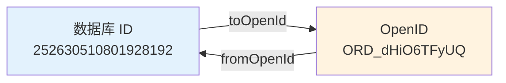

**代码示例：**

```java
@RestController
@RequestMapping("/orders")
public class OrderController {

    @GetMapping("/{openId}")
    public ApiResponse<OrderVO> getOrder(@PathVariable String openId) {
        // 1. 解析 OpenID 获取真实 ID
        Long orderId = IdObfuscator.fromOpenId(openId);

        // 2. 查询订单
        Order order = orderService.getById(orderId);

        // 3. 返回时再次混淆 ID
        OrderVO vo = new OrderVO();
        vo.setOpenId(IdObfuscator.toOpenId(order.getId(), "ORD"));
        vo.setOrderNo(order.getOrderNo());

        return ApiResponse.success(vo);
    }

    @PostMapping
    public ApiResponse<String> createOrder(@RequestBody OrderDTO dto) {
        Order order = orderService.create(dto);

        // 返回混淆后的 OpenID
        String openId = IdObfuscator.toOpenId(order.getId(), "ORD");
        return ApiResponse.success(openId);
    }
}
```

**特性：**
- ✅ Base62 编码 + XOR 混淆
- ✅ 支持自定义前缀（ORD、USR、PRD 等）
- ✅ 可逆解析（fromOpenId）
- ✅ 长度固定，URL 友好

### 4.4 ID 解析工具

**功能：** 无需查库，直接从 ID 中提取元数据

```java
public class IdAnalysisExample {

    public static void main(String[] args) {
        Long id = 252630510801928192L;

        // 提取生成时间
        LocalDateTime time = IdAnalysisTool.extractTime(id);
        System.out.println("生成时间: " + time);
        // 输出: 生成时间: 2025-11-28T11:03:27.223

        // 提取 WorkerID
        long workerId = IdAnalysisTool.extractWorkerId(id);
        System.out.println("WorkerID: " + workerId);
        // 输出: WorkerID: 100

        // 提取序列号
        long sequence = IdAnalysisTool.extractSequence(id);
        System.out.println("序列号: " + sequence);
        // 输出: 序列号: 0

        // 完整解析
        IdInfo info = IdAnalysisTool.parse(id);
        System.out.println(info);
        // 输出: IdInfo{id=252630..., dateTime=2025-11-28T11:03:27.223,
        //              sdkWorkerId=100, sequence=0}
    }
}
```

**应用场景：**
- 📊 数据分析：按生成时间分组统计
- 🐛 故障排查：定位哪个节点生成的 ID
- ⏱️ 性能监控：分析 ID 生成速率（序列号）

---


### 4.5 OpenID 类型转换器
* 用于 MyBatis/MyBatis-Plus 实体类字段的类型转换。
* 实现 Java String (OpenID) 与 Database BigInt/Integer (Long/Int ID) 的自动互转。
#### 支持的数据库类型:
* BIGINT (对应 Java Long)
* INT / INTEGER (对应 Java Integer)
* SERIAL (PostgreSQL, 对应 Integer)


#### 使用方式:
* 方式 1: 在实体类字段上指定 (推荐)
```java
 import fun.commons.framework4j.openid.handler.OpenIdTypeHandler;
 public class UserEntity {
     @TableId(type = IdType.ASSIGN_ID)
     @TableField(typeHandler = OpenIdTypeHandler.class)
     private String id;
 }
```
* 方式 2: 在 XML ResultMap 中指定

```xml

<result column="id" property="id" typeHandler="fun.commons.framework4j.openid.handler.OpenIdTypeHandler"/>
```
 
## 5. 高级特性

### 5.1 WorkerID 分配策略

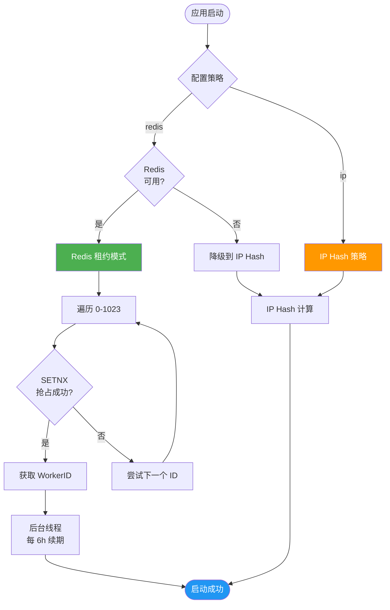

**策略对比：**

| 特性 | Redis 策略 | IP Hash 策略 |
|------|-----------|-------------|
| **适用场景** | 生产环境、K8s | 本地开发、无 Redis |
| **WorkerID 分配** | 动态分配 (0-1023) | IP Hash (可能冲突) |
| **容灾能力** | 高（租约自动释放） | 中（依赖 IP 唯一性） |
| **配置复杂度** | 低 | 极低 |
| **推荐度** | ⭐⭐⭐⭐⭐ | ⭐⭐⭐ |

### 5.2 多 Redis 场景

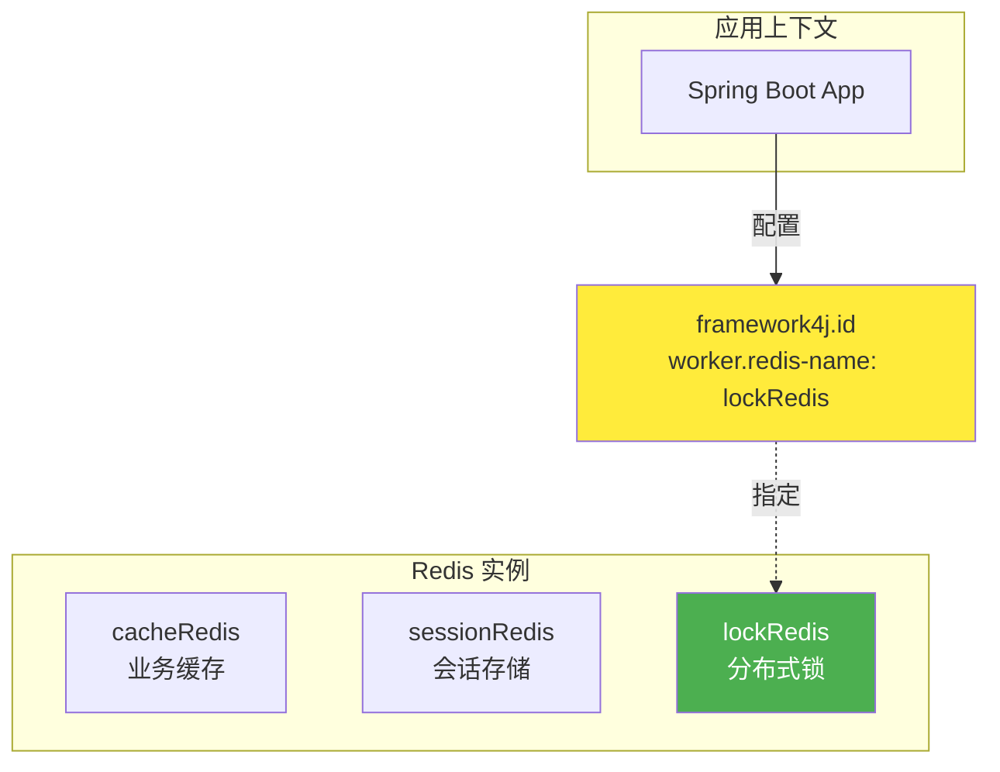

**配置示例：**

```yaml
framework4j:
  # 多 Redis 配置
  redis:
    datasources:
      cache:
        host: redis-cache
        port: 6379
      session:
        host: redis-session
        port: 6379
      lock:
        host: redis-lock
        port: 6379

  # ID SDK 指定使用 lockRedis
  id:
    worker:
      strategy: redis
      redis-name: lockRedisTemplate  # 指定 Bean 名称
```

### 5.3 性能基准

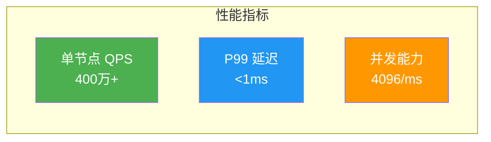

**压测数据：**

| 并发线程数 | QPS | P99 延迟 | 成功率 |
|-----------|-----|---------|--------|
| 10 | 1,200,000 | 0.3ms | 100% |
| 50 | 3,500,000 | 0.8ms | 100% |
| 100 | 4,200,000 | 1.2ms | 100% |

---

## 6. 最佳实践

### 6.1 推荐配置

**生产环境：**
```yaml
framework4j:
  id:
    worker:
      strategy: redis               # 使用 Redis 策略
      redis-name: stringRedisTemplate
    mybatis:
      enabled: true
```

**开发/测试环境：**
```yaml
framework4j:
  id:
    worker:
      strategy: ip                  # 无 Redis 时降级
    mybatis:
      enabled: true
```

### 6.2 注意事项

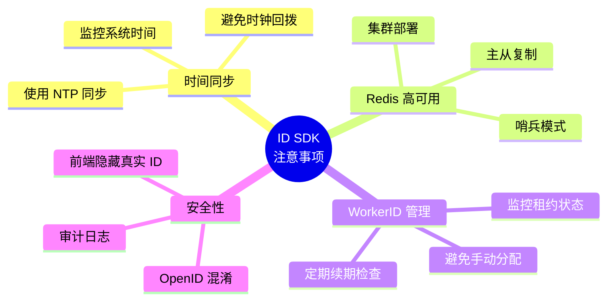

---

## 7. 故障排查

### 7.1 常见问题

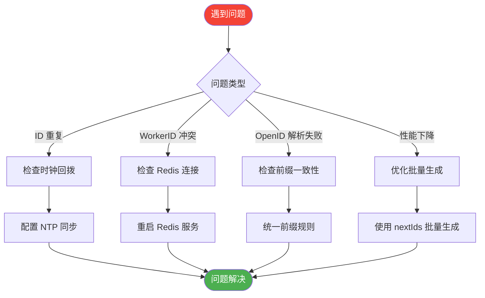

### 7.2 日志分析

**正常启动日志：**
```log
[ID-SDK] WorkerID strategy: Redis
[ID-SDK] WorkerID acquired via Redis Lease: 5
[ID-SDK] Snowflake initialized. SDK_WorkerId: 5
[ID-SDK] MyBatis-Plus IdentifierGenerator registered
```

**异常日志：**
```log
❌ [ID-SDK] Redis not available, fall back to IP Hash
⚠️ [ID-SDK] WorkerID conflict detected, retrying...
❌ [ID-SDK] Clock moved backwards, waiting...
```

---

## 附录

### A. 完整配置示例

```yaml
spring:
  application:
    name: order-system
  data:
    redis:
      host: localhost
      port: 6379

framework4j:
  id:
    worker:
      strategy: redis
      redis-name: stringRedisTemplate
    mybatis:
      enabled: true

# 数据源配置（MyBatis-Plus）
mybatis-plus:
  configuration:
    log-impl: org.apache.ibatis.logging.stdout.StdOutImpl
  global-config:
    db-config:
      id-type: assign_id  # 使用 SDK 生成 ID
```

### B. API 速查

| 类 | 方法 | 说明 |
|----|------|------|
| `SnowflakeDistributor` | `nextId()` | 生成单个 ID |
| `SnowflakeDistributor` | `nextIds(int count)` | 批量生成 ID |
| `IdObfuscator` | `toOpenId(Long id, String prefix)` | ID 混淆 |
| `IdObfuscator` | `fromOpenId(String openId)` | OpenID 解析 |
| `IdAnalysisTool` | `extractTime(Long id)` | 提取生成时间 |
| `IdAnalysisTool` | `extractWorkerId(Long id)` | 提取 WorkerID |
| `IdAnalysisTool` | `parse(Long id)` | 完整解析 ID |

---

**版本：** v1.0.0
**更新日期：** 2025-11-28
**维护团队：** Framework4j Team
