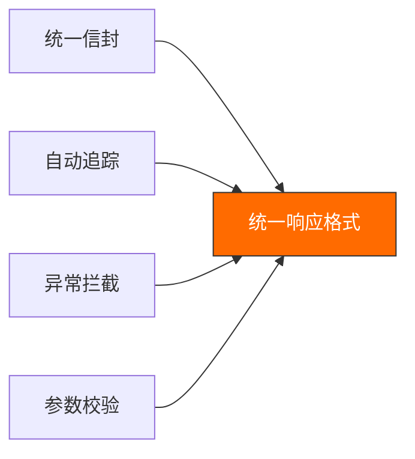
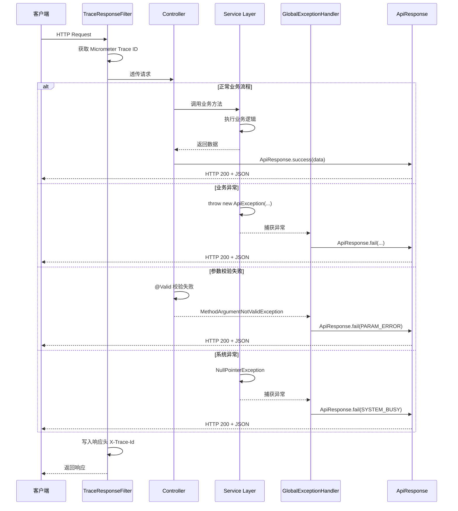
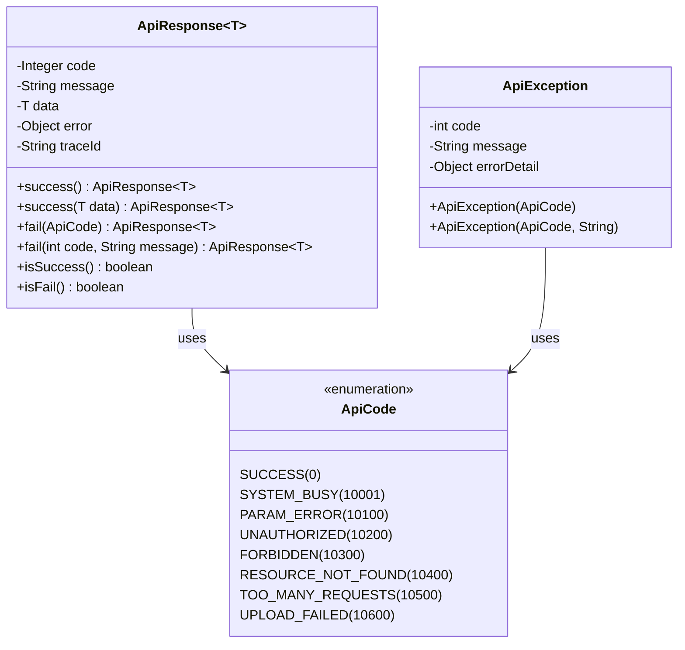
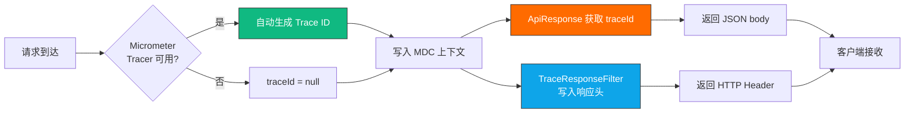
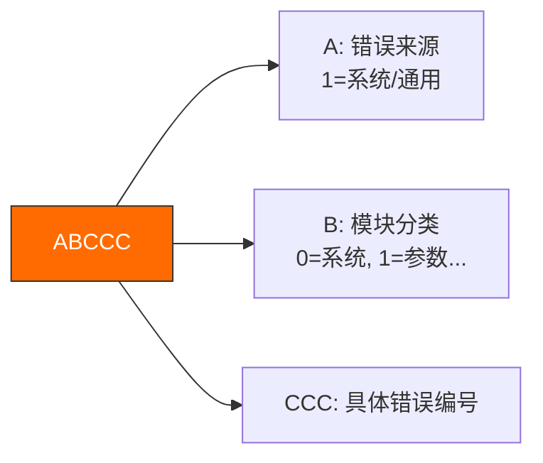
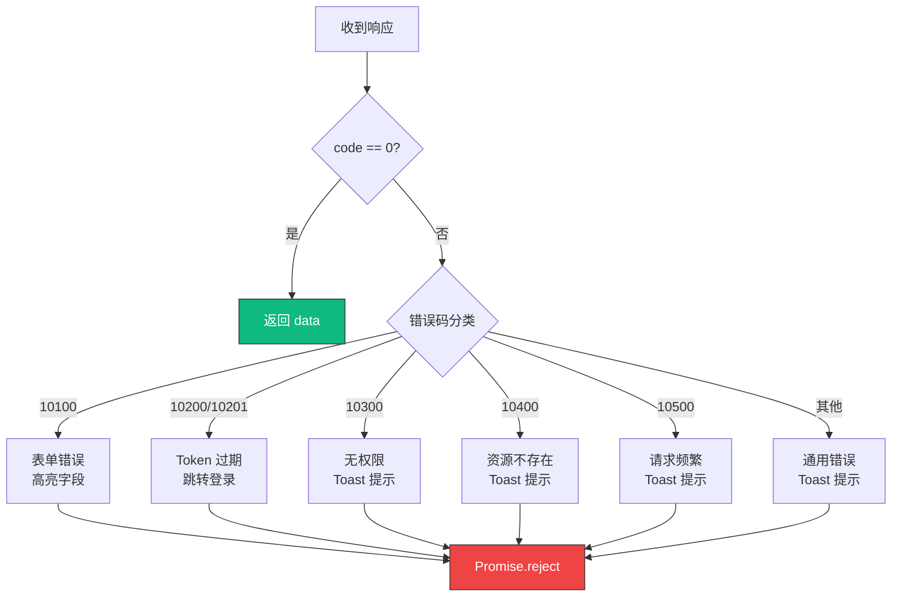
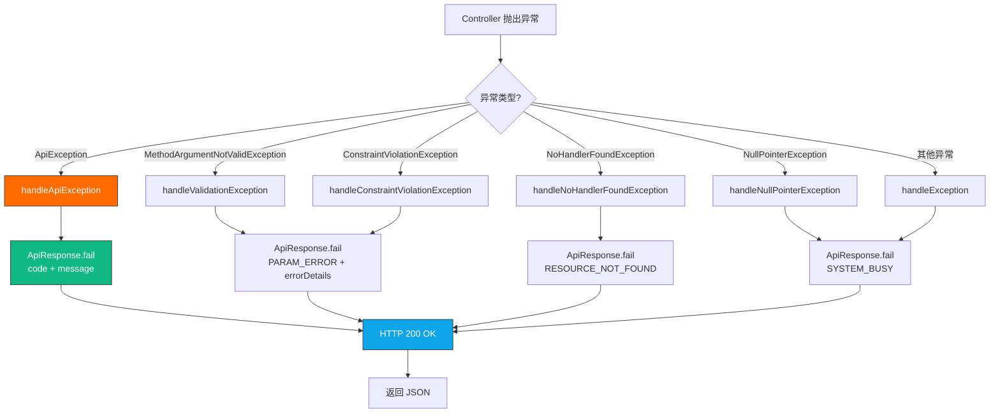
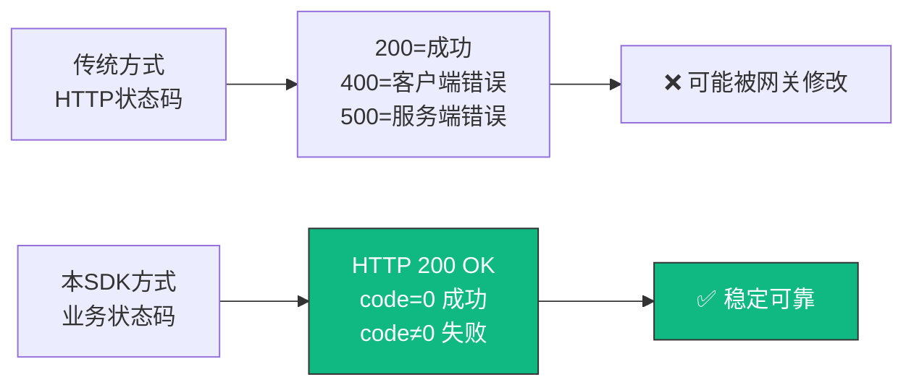

# API 统一响应与错误码 SDK (v1.0.0) 使用指南

## 1. 简介

本 SDK 是基于 **Spring Boot 3.x + Java 17** 构建的标准化组件,严格遵循《API 响应结构与错误码规范 v1.3》。它提供了统一的响应格式 `ApiResponse`、全链路追踪(Trace ID)以及全局异常处理机制。

**当前版本**: v1.0.0-SNAPSHOT

### 核心特性



- ✅ **统一信封**: 所有接口(成功/失败)均返回一致的 JSON 结构
- ✅ **自动追踪**: 集成 Micrometer Tracing,自动获取 trace_id
- ✅ **异常拦截**: 只需抛出业务异常,无需手动构建错误响应
- ✅ **参数校验**: 自动适配 JSR-303/380 (@Valid),并将校验结果转换为标准错误格式

---

## 2. 快速接入

### 2.1 依赖环境

确保项目包含以下依赖:

```xml
<dependencies>
    <!-- Spring Boot Starter Web 3.x -->
    <dependency>
        <groupId>org.springframework.boot</groupId>
        <artifactId>spring-boot-starter-web</artifactId>
    </dependency>

    <!-- Spring Boot Starter Validation -->
    <dependency>
        <groupId>org.springframework.boot</groupId>
        <artifactId>spring-boot-starter-validation</artifactId>
    </dependency>

    <!-- Lombok -->
    <dependency>
        <groupId>org.projectlombok</groupId>
        <artifactId>lombok</artifactId>
        <optional>true</optional>
    </dependency>

    <!-- Micrometer Tracing (可选,用于全链路追踪) -->
    <dependency>
        <groupId>io.micrometer</groupId>
        <artifactId>micrometer-tracing-bridge-otel</artifactId>
    </dependency>

    <!-- Fastjson2 (用于序列化) -->
    <dependency>
        <groupId>com.alibaba.fastjson2</groupId>
        <artifactId>fastjson2</artifactId>
    </dependency>
</dependencies>
```

---

### 2.2 核心组件清单

SDK 包含以下核心类:

| 类名                         | 包路径                              | 作用                           |
|------------------------------|-------------------------------------|-------------------------------|
| `ApiResponse<T>`             | `com.ldx2t.commons.api`             | 统一响应体封装                 |
| `ApiCode`                    | `com.ldx2t.commons.api`             | 错误码枚举                     |
| `ApiException`               | `com.ldx2t.commons.api`             | 业务异常类                     |
| `ApiAssert`                  | `com.ldx2t.commons.api`             | 业务断言工具类                 |
| `GlobalExceptionHandler`     | `com.ldx2t.commons.api`             | 全局异常处理器                 |
| `TraceConfig`                | `com.ldx2t.commons.api`             | 全链路追踪配置                 |
| `TraceContext`               | `com.ldx2t.commons.api`             | Trace ID 上下文工具            |

---

### 2.3 配置文件

为了捕获 404 错误并返回 JSON 格式,请在 `application.yml` 中添加:

```yaml
spring:
  mvc:
    # 当找不到处理器时抛出异常 (让 404 返回 JSON 而非 HTML)
    throw-exception-if-no-handler-found: true
  web:
    resources:
      # 禁用默认资源映射
      add-mappings: false

# 可选: 配置 Micrometer Tracing
management:
  tracing:
    sampling:
      probability: 1.0  # 采样率 100%
```

---

## 3. 架构设计

### 3.1 核心组件交互流程



---

### 3.2 响应结构



---

## 4. 后端开发指南

### 4.1 定义控制器 (Controller)

所有的 Controller 方法应返回 `ApiResponse<T>` 类型。

**示例代码:**

```java
package com.example.controller;

import com.example.dto.UserVO;
import com.example.service.UserService;
import com.ldx2t.commons.api.ApiResponse;
import lombok.RequiredArgsConstructor;
import org.springframework.web.bind.annotation.*;

@RestController
@RequestMapping("/api/users")
@RequiredArgsConstructor
public class UserController {

    private final UserService userService;

    /**
     * 查询用户详情
     */
    @GetMapping("/{id}")
    public ApiResponse<UserVO> getUser(@PathVariable Long id) {
        UserVO user = userService.findById(id);
        // 使用 success 包装返回数据
        return ApiResponse.success(user);
    }

    /**
     * 创建用户
     */
    @PostMapping
    public ApiResponse<Long> createUser(@Valid @RequestBody UserCreateRequest request) {
        Long userId = userService.create(request);
        return ApiResponse.success(userId, "用户创建成功");
    }

    /**
     * 删除用户
     */
    @DeleteMapping("/{id}")
    public ApiResponse<Void> deleteUser(@PathVariable Long id) {
        userService.delete(id);
        // 无返回数据时使用 success()
        return ApiResponse.success();
    }
}
```

---

### 4.2 抛出业务异常 (Service)

在业务逻辑层(Service),**不要**返回错误对象,直接抛出 `ApiException` 即可。

**示例代码:**

```java
package com.example.service;

import com.example.entity.Order;
import com.example.mapper.OrderMapper;
import com.ldx2t.commons.api.ApiCode;
import com.ldx2t.commons.api.ApiException;
import lombok.RequiredArgsConstructor;
import org.springframework.stereotype.Service;

@Service
@RequiredArgsConstructor
public class OrderService {

    private final OrderMapper orderMapper;

    public void payOrder(Long orderId) {
        Order order = orderMapper.selectById(orderId);

        // 场景1: 资源不存在 (对应错误码 10400)
        if (order == null) {
            throw new ApiException(ApiCode.RESOURCE_NOT_FOUND, "订单不存在");
        }

        // 场景2: 业务规则冲突 (对应错误码 10402)
        if (order.getStatus() != OrderStatus.PENDING) {
            throw new ApiException(ApiCode.STATE_CONFLICT, "订单状态已改变,无法支付");
        }

        // 场景3: 数据已存在 (对应错误码 10401)
        if (order.isPaid()) {
            throw new ApiException(ApiCode.DATA_EXISTS, "订单已支付,请勿重复操作");
        }

        // ... 处理支付逻辑
    }
}
```

---

### 4.3 使用 ApiAssert 简化代码

使用 `ApiAssert` 替代 `if-throw` 写法,让代码更简洁:

**传统写法 vs ApiAssert 写法:**

```java
// ❌ 传统写法 (冗长)
public void payOrder(Long orderId) {
    Order order = orderMapper.selectById(orderId);

    if (order == null) {
        throw new ApiException(ApiCode.RESOURCE_NOT_FOUND, "订单不存在");
    }

    if (order.getStatus() != OrderStatus.PENDING) {
        throw new ApiException(ApiCode.STATE_CONFLICT, "订单状态已改变");
    }

    // ... 处理支付逻辑
}

// ✅ ApiAssert 写法 (简洁)
public void payOrder(Long orderId) {
    Order order = orderMapper.selectById(orderId);

    // 断言对象不为空
    ApiAssert.notNull(order, ApiCode.RESOURCE_NOT_FOUND, "订单不存在");

    // 断言条件为真
    ApiAssert.isTrue(order.getStatus() == OrderStatus.PENDING,
                     ApiCode.STATE_CONFLICT, "订单状态已改变");

    // ... 处理支付逻辑
}
```

**ApiAssert 常用方法:**

| 方法                                            | 说明                      |
|------------------------------------------------|--------------------------|
| `isTrue(expression, apiCode, message)`         | 断言表达式为真            |
| `isFalse(expression, apiCode, message)`        | 断言表达式为假            |
| `notNull(object, apiCode, message)`            | 断言对象不为空            |
| `isNull(object, apiCode, message)`             | 断言对象为空              |
| `notEmpty(text, apiCode, message)`             | 断言字符串不为空          |
| `notEmpty(collection, apiCode, message)`       | 断言集合不为空            |
| `notEmpty(map, apiCode, message)`              | 断言 Map 不为空           |
| `failure(apiCode, message)`                    | 直接抛出异常              |

---

### 4.4 参数校验 (DTO)

使用标准的 Jakarta Validation 注解。SDK 会自动捕获校验失败并返回 `10100` 错误码。

**示例代码:**

```java
package com.example.dto;

import jakarta.validation.constraints.*;
import lombok.Data;

@Data
public class UserCreateRequest {

    @NotBlank(message = "用户名不能为空")
    @Size(min = 3, max = 20, message = "用户名长度必须在3-20之间")
    private String username;

    @Email(message = "邮箱格式不正确")
    @NotBlank(message = "邮箱不能为空")
    private String email;

    @NotNull(message = "年龄不能为空")
    @Min(value = 1, message = "年龄必须大于0")
    @Max(value = 150, message = "年龄必须小于150")
    private Integer age;

    @Pattern(regexp = "^1[3-9]\\d{9}$", message = "手机号格式不正确")
    private String phone;
}
```

**Controller 中使用 @Valid 触发校验:**

```java
@PostMapping
public ApiResponse<Long> createUser(@Valid @RequestBody UserCreateRequest request) {
    Long userId = userService.create(request);
    return ApiResponse.success(userId);
}
```

**校验失败时的响应:**

```json
{
  "code": 10100,
  "message": "请求参数错误",
  "data": null,
  "error": [
    {
      "field": "username",
      "message": "用户名不能为空",
      "rejectedValue": "null"
    },
    {
      "field": "email",
      "message": "邮箱格式不正确",
      "rejectedValue": "invalid-email"
    }
  ],
  "trace_id": "a1b2c3d4e5f6g7h8"
}
```

---

## 5. 全链路追踪 (Trace ID)

### 5.1 工作原理



### 5.2 Trace ID 传递

SDK 通过以下三个维度传递 Trace ID:

1. **响应头**: HTTP Response Header 包含 `X-Trace-Id`
2. **响应体**: JSON Body 包含 `trace_id` 字段
3. **日志**: MDC 自动注入 `traceId`,可在 logback pattern 中配置 `%X{traceId}` 输出

**Logback 配置示例:**

```xml
<configuration>
    <appender name="CONSOLE" class="ch.qos.logback.core.ConsoleAppender">
        <encoder>
            <pattern>%d{yyyy-MM-dd HH:mm:ss} [%thread] [TraceID:%X{traceId}] %-5level %logger{36} - %msg%n</pattern>
        </encoder>
    </appender>

    <root level="INFO">
        <appender-ref ref="CONSOLE" />
    </root>
</configuration>
```

**日志输出效果:**

```
2025-12-03 10:30:45 [http-nio-8080-exec-1] [TraceID:abc123xyz] INFO  c.e.s.UserService - 查询用户: userId=123
2025-12-03 10:30:46 [http-nio-8080-exec-1] [TraceID:abc123xyz] WARN  c.l.c.a.GlobalExceptionHandler - [业务异常] code=10400, message=用户不存在
```

---

## 6. 错误码设计规范

### 6.1 错误码格式

错误码格式: **ABCCC** (5位数字)



- **A**: 错误来源 (1: 系统/通用, 2: 业务A, 3: 业务B...)
- **B**: 模块分类 (0: 系统, 1: 参数, 2: 认证, 3: 权限, 4: 资源, 5: 流量, 6: 上传)
- **CCC**: 具体错误编号

---

### 6.2 标准错误码清单

#### 成功响应

| 错误码 | 枚举名称    | 说明     |
|-------|-----------|---------|
| 0     | `SUCCESS` | 操作成功 |

---

#### 10xxx: 系统与基础设施类

| 错误码 | 枚举名称               | 说明                 |
|-------|----------------------|---------------------|
| 10001 | `SYSTEM_BUSY`         | 系统繁忙,请稍后再试  |
| 10002 | `SERVICE_MAINTENANCE` | 服务暂停维护         |
| 10003 | `SERVICE_TIMEOUT`     | 服务调用超时         |
| 10004 | `THIRD_PARTY_ERROR`   | 第三方服务异常       |
| 10005 | `MIDDLEWARE_ERROR`    | 中间件服务异常       |

---

#### 101xx: 请求与参数校验类

| 错误码 | 枚举名称                    | 说明                |
|-------|---------------------------|---------------------|
| 10100 | `PARAM_ERROR`              | 请求参数错误        |
| 10101 | `PARAM_MISSING`            | 必填参数缺失        |
| 10102 | `PARAM_FORMAT_ERROR`       | 参数格式错误        |
| 10103 | `BODY_FORMAT_ERROR`        | 请求体格式错误      |
| 10104 | `METHOD_NOT_SUPPORTED`     | 请求方法不支持      |
| 10105 | `MEDIA_TYPE_NOT_SUPPORTED` | 媒体类型不支持      |
| 10106 | `BUSINESS_RULE_ERROR`      | 业务规则校验失败    |

---

#### 102xx: 认证与账号类

| 错误码 | 枚举名称             | 说明                      |
|-------|---------------------|--------------------------|
| 10200 | `UNAUTHORIZED`       | 用户未登录                |
| 10201 | `TOKEN_EXPIRED`      | 登录凭证已过期            |
| 10202 | `TOKEN_INVALID`      | 登录凭证无效              |
| 10203 | `CREDENTIAL_ERROR`   | 账号密码错误              |
| 10204 | `ACCOUNT_DISABLED`   | 账号已被冻结              |
| 10205 | `ACCOUNT_KICKOUT`    | 账号在异地登录被踢下线    |
| 10206 | `CAPTCHA_ERROR`      | 验证码错误                |

---

#### 103xx: 权限与授权类

| 错误码 | 枚举名称                  | 说明             |
|-------|-------------------------|-----------------|
| 10300 | `FORBIDDEN`              | 无权限访问       |
| 10301 | `DATA_PERMISSION_DENIED` | 数据权限不足     |
| 10302 | `SIGNATURE_ERROR`        | 签名验证失败     |
| 10303 | `IP_RESTRICTED`          | IP 限制访问      |

---

#### 104xx: 资源与数据类

| 错误码 | 枚举名称                | 说明                   |
|-------|----------------------|------------------------|
| 10400 | `RESOURCE_NOT_FOUND`  | 请求资源不存在         |
| 10401 | `DATA_EXISTS`         | 数据已存在             |
| 10402 | `STATE_CONFLICT`      | 数据状态冲突           |
| 10403 | `RESOURCE_LOCKED`     | 数据被锁定             |
| 10404 | `INTEGRITY_VIOLATION` | 数据完整性约束失败     |

---

#### 105xx: 流量控制类

| 错误码 | 枚举名称             | 说明           |
|-------|---------------------|---------------|
| 10500 | `TOO_MANY_REQUESTS`  | 请求过于频繁   |
| 10501 | `DUPLICATE_SUBMIT`   | 请勿重复提交   |
| 10502 | `SERVICE_DEGRADE`    | 服务降级       |

---

#### 106xx: 文件与上传类

| 错误码 | 枚举名称          | 说明             |
|-------|------------------|-----------------|
| 10600 | `UPLOAD_FAILED`   | 文件上传失败     |
| 10601 | `FILE_TYPE_ERROR` | 文件类型不支持   |
| 10602 | `FILE_SIZE_EXCEED`| 文件体积过大     |
| 10603 | `FILE_EMPTY`      | 文件内容为空     |

---

## 7. 前端对接指南

### 7.1 响应结构示例

#### 成功响应 (code: 0)

```json
{
  "code": 0,
  "message": "操作成功",
  "data": {
    "id": 123,
    "name": "张三",
    "email": "zhangsan@example.com"
  },
  "error": null,
  "trace_id": "a1b2c3d4e5f6g7h8"
}
```

---

#### 失败响应 - 业务异常 (code: 104xx)

```json
{
  "code": 10400,
  "message": "用户 ID 999 不存在",
  "data": null,
  "error": null,
  "trace_id": "a1b2c3d4e5f6g7h8"
}
```

---

#### 失败响应 - 参数校验 (code: 10100)

```json
{
  "code": 10100,
  "message": "请求参数错误",
  "data": null,
  "error": [
    {
      "field": "email",
      "message": "邮箱格式不正确",
      "rejectedValue": "invalid-email"
    },
    {
      "field": "username",
      "message": "用户名不能为空",
      "rejectedValue": "null"
    }
  ],
  "trace_id": "a1b2c3d4e5f6g7h8"
}
```

---

### 7.2 前端处理逻辑 (Axios 示例)

**JavaScript/TypeScript 拦截器:**

```typescript
import axios from 'axios';
import { ElMessage } from 'element-plus';

// 创建 axios 实例
const request = axios.create({
  baseURL: '/api',
  timeout: 10000
});

// 响应拦截器
request.interceptors.response.use(
  response => {
    const res = response.data;

    // 1. 判断 trace_id (可选：用于日志上报)
    const traceId = res.trace_id;
    if (traceId) {
      console.log(`[Trace ID] ${traceId}`);
    }

    // 2. 判断业务状态码
    if (res.code === 0) {
      // 成功：返回业务数据
      return res.data;
    } else {
      // 失败：统一处理
      handleError(res);
      return Promise.reject(new Error(res.message || '请求失败'));
    }
  },
  error => {
    // HTTP 层面错误(网络异常等)
    console.error('[HTTP Error]', error);
    ElMessage.error('网络异常,请稍后重试');
    return Promise.reject(error);
  }
);

// 错误处理函数
function handleError(res) {
  if (res.code === 10100) {
    // 参数错误：高亮表单字段
    if (res.error && Array.isArray(res.error)) {
      showFormErrors(res.error);
    } else {
      ElMessage.error(res.message);
    }
  } else if (res.code === 10200 || res.code === 10201) {
    // Token 过期：跳转登录
    ElMessage.warning('登录已过期,请重新登录');
    redirectToLogin();
  } else if (res.code === 10300) {
    // 无权限访问
    ElMessage.error('无权限访问');
  } else {
    // 其他错误：Toast 提示 message
    ElMessage.error(res.message || '操作失败');
  }
}

// 显示表单错误
function showFormErrors(errors) {
  errors.forEach(error => {
    console.error(`[字段错误] ${error.field}: ${error.message}`);
  });
  ElMessage.error('请修正表单错误后重试');
}

// 重定向到登录页
function redirectToLogin() {
  window.location.href = '/login';
}

export default request;
```

---

### 7.3 前端错误码处理建议



---

## 8. 全局异常处理机制

### 8.1 异常处理流程



---

### 8.2 异常处理清单

| 异常类型                              | 处理方法                               | 返回错误码         |
|--------------------------------------|--------------------------------------|-------------------|
| `ApiException`                       | `handleApiException`                 | 自定义错误码      |
| `MethodArgumentNotValidException`    | `handleValidationException`          | `10100`           |
| `BindException`                      | `handleValidationException`          | `10100`           |
| `ConstraintViolationException`       | `handleConstraintViolationException` | `10100`           |
| `MethodArgumentTypeMismatchException`| `handleMethodArgumentTypeMismatchException` | `10102`    |
| `HttpMessageNotReadableException`    | `handleHttpMessageNotReadableException` | `10103`        |
| `HttpRequestMethodNotSupportedException` | `handleHttpRequestMethodNotSupportedException` | `10104` |
| `HttpMediaTypeNotSupportedException` | `handleHttpMediaTypeNotSupportedException` | `10105`     |
| `NoHandlerFoundException`            | `handleNoHandlerFoundException`      | `10400`           |
| `IllegalArgumentException`           | `handleIllegalArgumentException`     | `10106`           |
| `NullPointerException`               | `handleNullPointerException`         | `10001`           |
| 其他未捕获异常                        | `handleException`                    | `10001`           |

---

## 9. 常见问题 (FAQ)

### Q1: 为什么 HTTP 状态码全是 200?

**A:** 本规范采用业务状态码(JSON 中的 `code`)作为逻辑判断依据。HTTP 状态码(如 400, 500)可能被网关或代理拦截修改,不够稳定。

**原因:**

- ✅ 网关/负载均衡器可能修改 HTTP 状态码
- ✅ 前端可以统一处理所有响应(不需要区分 HTTP 状态码)
- ✅ 避免 CORS 预检请求失败

**设计理念:**



---

### Q2: 如何处理 Long 类型精度丢失问题?

**A:** 当 `data` 中的 ID 超过 16 位(如雪花算法 ID)时,JavaScript 会丢失精度。

**解决方案:** 在后端的 Long 字段上添加 `@JsonSerialize(using = ToStringSerializer.class)`,将其转为 String 返回给前端。

```java
import com.fasterxml.jackson.databind.annotation.JsonSerialize;
import com.fasterxml.jackson.databind.ser.std.ToStringSerializer;
import lombok.Data;

@Data
public class UserVO {

    /**
     * 用户 ID (雪花算法)
     * 序列化为字符串避免 JS 精度丢失
     */
    @JsonSerialize(using = ToStringSerializer.class)
    private Long id;

    private String username;
    private String email;
}
```

**效果对比:**

```json
// ❌ 未使用 ToStringSerializer (前端精度丢失)
{
  "id": 1234567890123456789,  // JS 会解析为 1234567890123456800
  "username": "zhangsan"
}

// ✅ 使用 ToStringSerializer (精度保持)
{
  "id": "1234567890123456789",  // 字符串形式,精度完整
  "username": "zhangsan"
}
```

---

### Q3: 404 页面返回了 HTML 怎么办?

**A:** 请检查 `application.yml` 是否配置了 `throw-exception-if-no-handler-found: true`。必须开启此项,Spring 才会抛出异常被 `GlobalExceptionHandler` 捕获。

```yaml
spring:
  mvc:
    throw-exception-if-no-handler-found: true  # ✅ 必须开启
  web:
    resources:
      add-mappings: false  # ✅ 禁用静态资源映射
```

---

### Q4: 如何自定义错误码?

**A:** 在 `ApiCode` 枚举中添加新的错误码即可。

```java
public enum ApiCode {
    // ... 标准错误码

    // 自定义业务错误码 (20xxx: 业务A)
    ORDER_CANCELED(20001, "订单已取消"),
    ORDER_EXPIRED(20002, "订单已过期"),
    PAYMENT_FAILED(20003, "支付失败"),

    // 自定义业务错误码 (30xxx: 业务B)
    PRODUCT_OUT_OF_STOCK(30001, "商品库存不足"),
    PRODUCT_DISCONTINUED(30002, "商品已下架");

    // ... 构造函数和方法
}
```

---

### Q5: 如何集成 Micrometer Tracing?

**A:** 添加依赖即可自动启用。

**添加依赖:**

```xml
<!-- Micrometer Tracing 核心 -->
<dependency>
    <groupId>io.micrometer</groupId>
    <artifactId>micrometer-tracing-bridge-otel</artifactId>
</dependency>

<!-- OpenTelemetry Exporter (可选,用于导出到 Jaeger/Zipkin) -->
<dependency>
    <groupId>io.opentelemetry</groupId>
    <artifactId>opentelemetry-exporter-otlp</artifactId>
</dependency>
```

**配置:**

```yaml
management:
  tracing:
    sampling:
      probability: 1.0  # 采样率 100%
  otlp:
    tracing:
      endpoint: http://localhost:4318/v1/traces  # OTLP 导出端点
```

---

### Q6: 如何测试 API 响应?

**A:** 使用 Postman 或 curl 测试。

**Postman 测试示例:**

```
GET http://localhost:8080/api/users/123
```

**curl 测试示例:**

```bash
# 成功响应
curl -X GET http://localhost:8080/api/users/123

# 业务异常响应
curl -X GET http://localhost:8080/api/users/999

# 参数校验失败响应
curl -X POST http://localhost:8080/api/users \
  -H "Content-Type: application/json" \
  -d '{"username":"","email":"invalid-email"}'
```

---

## 10. 最佳实践

### 10.1 Controller 层规范

```java
@RestController
@RequestMapping("/api/orders")
@RequiredArgsConstructor
public class OrderController {

    private final OrderService orderService;

    // ✅ 正确写法: 统一返回 ApiResponse
    @GetMapping("/{id}")
    public ApiResponse<OrderVO> getOrder(@PathVariable Long id) {
        OrderVO order = orderService.findById(id);
        return ApiResponse.success(order);
    }

    // ❌ 错误写法: 直接返回业务对象
    @GetMapping("/{id}")
    public OrderVO getOrder(@PathVariable Long id) {
        return orderService.findById(id);  // 缺少统一信封
    }
}
```

---

### 10.2 Service 层规范

```java
@Service
@RequiredArgsConstructor
public class OrderService {

    private final OrderMapper orderMapper;

    // ✅ 正确写法: 直接抛出异常
    public OrderVO findById(Long id) {
        Order order = orderMapper.selectById(id);
        ApiAssert.notNull(order, ApiCode.RESOURCE_NOT_FOUND, "订单不存在");
        return OrderConverter.toVO(order);
    }

    // ❌ 错误写法: 返回错误响应
    public ApiResponse<OrderVO> findById(Long id) {
        Order order = orderMapper.selectById(id);
        if (order == null) {
            return ApiResponse.fail(ApiCode.RESOURCE_NOT_FOUND);  // Service 不应返回 ApiResponse
        }
        return ApiResponse.success(OrderConverter.toVO(order));
    }
}
```

---

### 10.3 异常处理规范

```java
// ✅ 正确写法: 使用 ApiException
throw new ApiException(ApiCode.RESOURCE_NOT_FOUND, "订单不存在");

// ✅ 正确写法: 使用 ApiAssert
ApiAssert.notNull(order, ApiCode.RESOURCE_NOT_FOUND, "订单不存在");

// ❌ 错误写法: 抛出普通异常
throw new RuntimeException("订单不存在");  // 会被转换为 SYSTEM_BUSY (10001)

// ❌ 错误写法: 返回 null
return null;  // 可能导致 NullPointerException
```

---

## 11. 相关文档

- [API 统一响应与错误码 SDK 技术方案 (v1.3)](./API 统一响应与错误码 SDK 技术方案 (v1.3).md)
- [ldx2t-commons-sdk 用户指南](../ldx2t-commons-sdk%20用户指南.md)
- [Spring Boot 3 + Micrometer 全链路 SQL 追踪方案](../ldx2t-commons-datasource/Spring Boot 3 + Micrometer 全链路 SQL 追踪方案.md)

---

**文档版本:** v1.3
**最后更新:** 2025-12-03
**适用版本:** ldx2t-commons-api 1.0.0+
**作者:** LDX2T 架构团队
