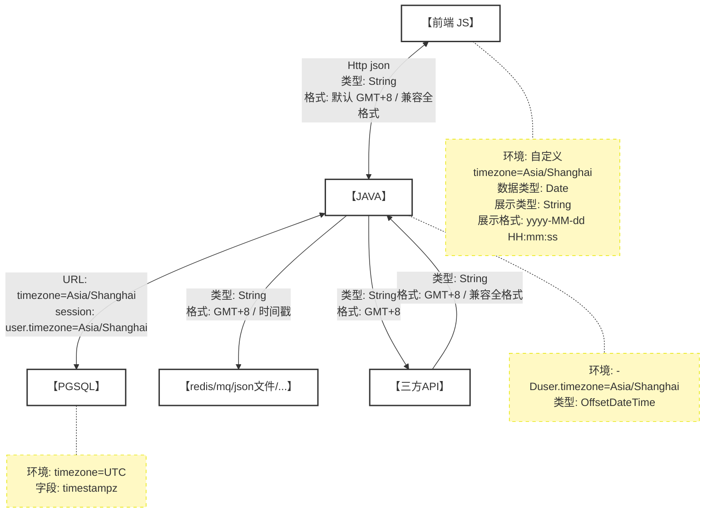

# Java开发时间处理规范

> **版本**: v1.3.0
> **核心策略**: UTC → GMT+8 → API交互（GMT+8） → 前端展示（本地格式）
> **适用场景**: 快速参考、新人上手、代码评审


## 5种时间格式对照表

本规范涉及5种常用时间格式，每种格式有各自的应用场景和优缺点。

| 格式名称              | 简写                  | 格式示例 | 主要特点 |
|-------------------|---------------------|---------|----------|
| **UTC 格式**        | UTC                 | `2025-12-10T02:00:00Z`  | ✅ 标准UTC<br>✅ 零时区<br>⚠️ 需换算 |
| **GMT 北京时间** | GMT+8 | `2025-12-10T10:00:00+08:00`  | ✅ 国际标准<br>✅ 显式时区<br>✅ 可读性好 |
| **本地简化格式**        | Local Format        | `2025-12-10 10:00:00` | ✅ 简洁<br>✅ 用户友好<br>⚠️ 无时区信息 |
| **Unix 时间戳（毫秒）**  | Timestamp / Millis  | `1733882400000` | ✅ 性能极高<br>✅ 绝对时间<br>❌ 不易读 |
| **Unix 时间戳（秒）**   | Timestamp / Epoch   | `1733882400`  | ✅ 性能极高<br>✅ 兼容性好<br>❌ 不易读 |

## 时间数据流转格式对照图




##  数据库PGSQL规范
### 连接配置
#### 用户session级别配置 (强制)
**配置步骤：**
```sql
-- 为指定用户设置默认时区 如：美国部署应用不同的账号和对应的时区
ALTER USER your_username SET timezone TO 'Asia/Shanghai';

-- 验证配置
SHOW timezone;  -- 重连后显示 GMT+8
```
**优势：**
- ✅ 一次配置，永久生效，无需每次连接都加参数
- ✅ 所有客户端工具（pgAdmin、DataGrip、应用程序）自动生效
- ✅ 查询结果显示为 GMT+8 格式，清晰直观，不会歧义

#### 连接字符串参数 (强制)
 需要在每次连接时添加 `timezone` 参数， 与方案一冗余 确保时区一致。

```bash
# JDBC 连接（Java应用）
jdbc:postgresql://localhost:5432/mydb?timezone=Asia/Shanghai
# psql 命令行工具
PGTZ=Asia/Shanghai psql -h localhost -U postgres -d mydb
```

### 建表规范

> ❗ **强制**: 必须使用 `TIMESTAMPTZ` 而非 `TIMESTAMP`  

```sql
CREATE TABLE sys_log (
    id BIGSERIAL PRIMARY KEY,
    create_time TIMESTAMPTZ NOT NULL DEFAULT CURRENT_TIMESTAMP,
    update_time TIMESTAMPTZ NOT NULL DEFAULT CURRENT_TIMESTAMP
);

CREATE INDEX idx_sys_log_create_time ON sys_log(create_time);
```

### 查询示例

#### 时区处理说明

> 💡 **重要**：在已设置时区（`ALTER USER SET timezone`）的情况下，带时区和不带时区的时间字符串**等价**

**前提条件：** 已执行 `ALTER USER your_username SET timezone TO 'Asia/Shanghai';` 并重新连接

```sql
-- ✅ 推荐：不指定时区，依赖 session 配置（前提：已设置时区）
WHERE create_time >= '2025-12-10 00:00:00'

-- ❌ 不允许：显式指定时区，时区不可以硬编码到程序中
WHERE create_time >= '2025-12-10 00:00:00+08:00'

-- ❌ 不允许：使用 Java 拼接时间字符串（应该使用 OffsetDateTime 参数）
WHERE create_time >= '" + timeString + "'  -- 反模式
```

#### 其他查询示例

```sql
-- ✅ 按天分组统计
SELECT date_trunc('day', create_time) as stat_date, count(*)
FROM sys_log
GROUP BY 1
ORDER BY 1;

-- ❌ 错误：类型转换导致索引失效
SELECT * FROM sys_log WHERE create_time::DATE = '2025-12-10';
```

---

## Java 后端开发规范

### 系统时区配置

> ❗ **强制**: 使用 `OffsetDateTime.now()` 依赖系统默认时区，必须正确配置环境时区

**JVM 参数（强制）**
```bash
java -Duser.timezone=Asia/Shanghai -jar your-application.jar
```

**环境变量（强制）**
```bash
# Linux/Mac
export TZ=Asia/Shanghai

# Docker
docker run -e TZ=Asia/Shanghai your-image
```

**验证时区**
```java
@PostConstruct
public void checkTimezone() {
    String timezone = TimeZone.getDefault().getID();
    log.info("当前系统时区: {}", timezone);
    if (!"Asia/Shanghai".equals(timezone)) {
        log.warn("警告：当前时区不是 Asia/Shanghai，实际为: {}", timezone);
    }
}
```

### 统一使用 OffsetDateTime（强制）

```java
// ✅ 正确：使用 OffsetDateTime
@Data
public class UserEntity {
    private Long id;
    private OffsetDateTime createTime;  // 自动携带时区信息
}

// ❌ 错误：禁止使用 String 传递时间
public void badMethod(String startTime, String endTime) { }

// ✅ 正确：使用 OffsetDateTime 参数
public void goodMethod(OffsetDateTime startTime, OffsetDateTime endTime) { }
```

#### API参数接收 OffsetDateTime

```java
@RestController
@RequestMapping("/api/users")
public class UserController {
    
    @GetMapping("/list")
    public Result<List<UserVO>> list(
        // Spring MVC 自动转换入参，支持多种格式：
        // - 2025-12-10 10:00:00
        // - 2025-12-10T10:00:00+08:00
        // - 1733882400000 (时间戳)
        // UserVO 中的 OffsetDateTime 输出 "2025-12-10T10:00:00+08:00"
        // 时区明确，前端可以正确解析
        @RequestParam(required = false) OffsetDateTime startTime,
        // ❌ 反例：不可以使用 String 接收时间参数
        @RequestParam(required = false) String endTime
    ) {
        return Result.success(userService.list(startTime, endTime));
    }
    
}
```

#### 获取当前时间

```java
@Service
public class UserService {
    // ✅ 推荐：使用系统默认时区
    // 优势：多地区部署只需修改环境变量，无需修改代码
    public void createUser() {
        OffsetDateTime now = OffsetDateTime.now();
        user.setCreateTime(now);
    }

    // ⚠️ 不推荐：硬编码时区
    public void badExample() {
        OffsetDateTime now = OffsetDateTime.now(ZoneId.of("Asia/Shanghai"));
    }
}
```
#### 时间计算

```java
// ✅ 计算订单超时
OffsetDateTime timeout = OffsetDateTime.now().plusHours(24);

// ✅ 查询今天创建的订单
OffsetDateTime today = LocalDate.now()
    .atStartOfDay()
    .atZone(ZoneId.systemDefault())
    .toOffsetDateTime();

// ✅ 判断时间是否在范围内
boolean inRange = orderTime.isAfter(startTime) && orderTime.isBefore(endTime);
```

---

**特殊场景（本地简化格式）**： 在与第三方对接等有特殊需求时报备后使用本地简化格式（yyyy-MM-dd HH:mm:ss）。

```java
@RestController
@RequestMapping("/api/orders")
public class OrderController {

    // ⚠️ 特殊：使用 @LocalTimeFormat 注解
    @LocalTimeFormat  // 必须加在方法或类上
    @GetMapping
    public Result<List<OrderVO>> list() {
        // OrderVO 输出: "2025-12-10 10:00:00"
        // ⚠️ 必须在接口文档中说明时间格式
        return Result.success(orderService.list());
    }
}
```

---


## 前端开发规范

### 核心原则

1. **数据交互使用 GMT+8 时区**
    - 后端返回的时间统一为 GMT+8 时区（默认 ISO-8601），同时要兼容全格式时间
    - 前端提交时间必须转换为 GMT+8 时区
    - **禁止使用用户浏览器本地时区**

2. **展示层使用本地时间格式**
    - 前端展示时间格式：`yyyy-MM-dd HH:mm:ss`
    - 时区固定为 GMT+8（北京时间）
    - 不随用户浏览器时区变化

3. **兼容全格式时间**
    - 支持 UTC 格式：`2025-12-10T02:00:00Z`
    - 支持 GMT+8 格式：`2025-12-10T10:00:00+08:00`
    - 支持本地格式：`2025-12-10 10:00:00`
    - 支持时间戳（毫秒/秒）：`1733882400000`/`1733882400`
    - 支持日期格式：`2025-12-10`

### ⚙️ 配置文件要求

前端项目必须在配置文件中声明时区和时间格式配置项，确保全项目统一的时间处理标准。

#### 中国区配置（强制要求）

```javascript
// config/app.config.js
export default {
  // 时区配置：中国区统一使用 Asia/Shanghai
  timezone: 'Asia/Shanghai',

  // 本地时间格式：前端展示时间格式
  localTimeFormat: 'yyyy-MM-dd HH:mm:ss',

  // GMT+8 时区偏移（毫秒）
  timezoneOffset: 8 * 60 * 60 * 1000,

  // ISO-8601 时区后缀
  timezoneISO: '+08:00'
};
```


## ❌ 常见错误

### 错误1：使用 String 类型传递时间

```java
// ❌ 错误
public List<Order> getOrders(String startTime, String endTime) {
    OffsetDateTime start = OffsetDateTime.parse(startTime);  // 手动解析
    return orderMapper.findByTimeRange(start, end);
}

// ✅ 正确
public List<Order> getOrders(OffsetDateTime startTime, OffsetDateTime endTime) {
    return orderMapper.findByTimeRange(startTime, endTime);  // Spring自动转换
}
```

### 错误2：注解位置错误

```java
// ❌ 错误：注解加在字段上（无效）
@Data
public class UserVO {
    @LocalTimeFormat  // ❌ 注解不支持字段
    private OffsetDateTime createTime;
}

// ✅ 正确：注解加在 Controller 方法/类上
@RestController
public class UserController {
    @LocalTimeFormat  // ✅ 正确位置
    @GetMapping("/users")
    public Result<List<UserVO>> list() {
        return Result.success(userService.list());
    }
}
```

### 错误3：内部API加注解

```java
// ❌ 错误：微服务内部API加 @LocalTimeFormat
@RestController
public class InternalOrderController {
    @LocalTimeFormat  // ❌ 错误：丢失时区信息
    @GetMapping("/internal/orders")
    public List<OrderDTO> getOrders() { }
}

// ✅ 正确：内部API不加注解
@RestController
public class InternalOrderController {
    // ✅ 无注解，保留 ISO-8601 格式
    @GetMapping("/internal/orders")
    public List<OrderDTO> getOrders() { }
}
```

### 错误4：Entity 使用 @Data

```java
// ❌ 错误：Entity使用@Data可能导致 StackOverflowError
@Data
@TableName("sys_user")
public class UserEntity {
    private OffsetDateTime createTime;
}

// ✅ 正确：使用 @Getter + @Setter
@Getter @Setter @ToString
@TableName("sys_user")
public class UserEntity {
    private OffsetDateTime createTime;
}
```

---

## 快速参考

### 时间格式转换

```java
// OffsetDateTime → ISO-8601 字符串
String isoString = offsetDateTime.toString();

// ISO-8601 字符串 → OffsetDateTime
OffsetDateTime dt = OffsetDateTime.parse("2025-12-10T10:00:00+08:00");

// OffsetDateTime → 毫秒时间戳
long millis = offsetDateTime.toInstant().toEpochMilli();

// 毫秒时间戳 → OffsetDateTime
OffsetDateTime dt = Instant.ofEpochMilli(millis)
    .atZone(ZoneId.systemDefault()).toOffsetDateTime();

// OffsetDateTime → 秒级时间戳
long seconds = offsetDateTime.toEpochSecond();

// 秒级时间戳 → OffsetDateTime
OffsetDateTime dt = Instant.ofEpochSecond(seconds)
    .atZone(ZoneId.systemDefault()).toOffsetDateTime();
```

### 时间比较和计算

```java
// 获取当前时间
OffsetDateTime now = OffsetDateTime.now();

// 时间比较
boolean isBefore = time1.isBefore(time2);
boolean isAfter = time1.isAfter(time2);
boolean isEqual = time1.isEqual(time2);

// 时间计算
OffsetDateTime tomorrow = now.plusDays(1);
OffsetDateTime lastWeek = now.minusWeeks(1);
OffsetDateTime nextMonth = now.plusMonths(1);

// 时间差
Duration duration = Duration.between(time1, time2);
long daysBetween = ChronoUnit.DAYS.between(time1, time2);
```

---

## ✅ 开发检查清单

**数据库层**
- [ ] 使用 `TIMESTAMPTZ` 类型（不是 `TIMESTAMP`）
- [ ] 配置用户级时区：`ALTER USER app_user SET timezone TO 'Asia/Shanghai';`
- [ ] JDBC URL 包含 timezone 参数（备选方案）

**应用层**
- [ ] JVM 时区参数：`-Duser.timezone=Asia/Shanghai`
- [ ] 实体类使用 `OffsetDateTime`
- [ ] Entity 使用 `@Getter` + `@Setter`（禁止 `@Data`）
- [ ] 禁止使用 String 传递时间参数

**API层**
- [ ] 前端API默认不加注解（输出 ISO-8601）
- [ ] 特殊场景使用 `@LocalTimeFormat` 并在文档说明
- [ ] 内部API不加注解（保留时区）
- [ ] VO/DTO无需添加注解


---

